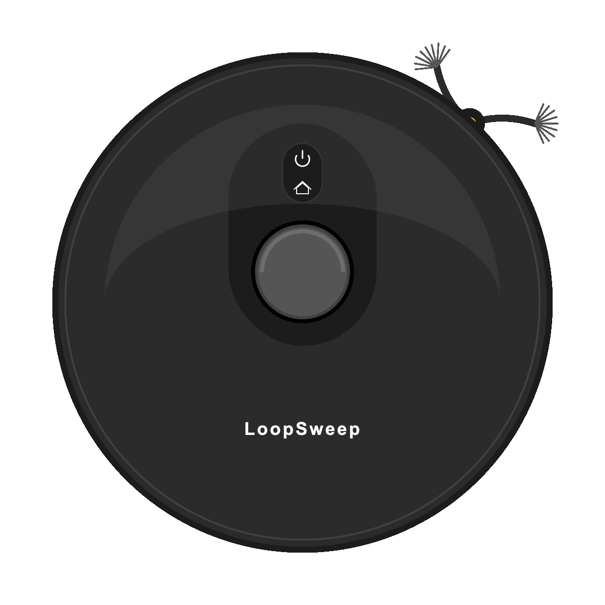

<div align="center">
  
  
  <br/>
  <a href="README.md"></a>
  &nbsp;&nbsp;&nbsp;
  <a href="README_PAUSED.md"></a>
  <br/>

  # 🧹 LoopSweep
  **A Next-Generation, Beautifully Crafted Robot Vacuum Controller built with Compose Multiplatform.**
  
  [](http://kotlinlang.org)
  [](https://www.jetbrains.com/lp/compose-mpp/)
  [](#)
  [](#)
  [](#)
</div>

<br/>

## 🌟 Overview

**LoopSweep** is a cutting-edge cross-platform application designed to control, monitor, and manage your smart robot vacuum cleaner. Built entirely with **Kotlin Multiplatform (KMP)** and **Compose Multiplatform**, it delivers a pixel-perfect, native-like experience across Android, iOS, and Desktop environments using a single shared codebase.

Instead of relying on static assets, LoopSweep uses high-performance, real-time **Canvas Drawing** and **Infinite Animations** to bring the robot vacuum to life right inside your UI!

---

## ✨ Key Features

### 🎨 Stunning Visuals & UI
* **Glassmorphism Design:** Beautiful frosted-glass translucent bottom navigation bars.
* **Dark Mode Native:** A deeply immersive, sleek dark theme with glowing neon accents (`#10B981` Green for active cleaning, `#FBBF24` Gold for charging).
* **Minimalist Aesthetics:** Custom-drawn icons, precisely tailored stroke widths (`0.4.dp`), and refined component sizing for a premium feel.

### 🤖 Dynamic Canvas Animations (`RobotVacuumButtonContent`)
The centerpiece of the application is the `RobotVacuumButtonContent`, entirely built from scratch using Compose `Canvas`.
* **LiDAR Turret:** A miniaturized, chrome-bezeled LiDAR dome that spins realistically during cleaning.
* **Flexing Side Brushes:** Advanced trigonometry and quadratic bezier curves calculate real-time drag and bristle-spread as the side brushes spin!
* **Pulsing Status LEDs:** Glowing Power and Home indicators that breathe based on the robot's current state (Cleaning / Charging).

### 🛠️ Developer Experience
* **Custom Previews:** Uses a specialized `@LoopSweepPreview` annotation to isolate, test, and render components instantly without launching the full app.
* **Component-Based Architecture:** Fully modularized components (e.g., `RobotVacuumButtonContent`, `GlassmorphicBottomNavigation`).

---

## 📸 Screenshots & Previews

*(Replace these placeholders with your actual project screenshots / GIFs)*

<p align="center">
  
  &nbsp;&nbsp;&nbsp;&nbsp;
  
  <br/><br/>
  
</p>

---

## 🏗️ Project Structure

The repository is organized following standard Kotlin Multiplatform guidelines:

```text
LoopSweep/
├── shared/               # The core logic & UI shared across ALL platforms!
│   └── src/
│       ├── commonMain/   # Compose UI (VacuumApp.kt, RobotVacuumButtonContent.kt)
│       ├── androidMain/  # Android-specific implementations
│       ├── iosMain/      # iOS-specific bindings
│       └── desktopMain/  # JVM/Desktop window settings
├── androidApp/           # Android application entry point & Manifest
├── desktopApp/           # Desktop (JVM) main function & packaging
└── iosApp/               # Xcode project and SwiftUI wrapper for iOS
```

### 📂 Important Files
* [`shared/src/commonMain/kotlin/com/vahitkeskin/loopsweep/VacuumApp.kt`](shared/src/commonMain/kotlin/com/vahitkeskin/loopsweep/VacuumApp.kt): The root Compose application, handling navigation, state (`isCleaning`, `isCharging`), and the glassmorphic bottom bar.
* [`shared/src/commonMain/kotlin/com/vahitkeskin/loopsweep/ui/components/RobotVacuumButtonContent.kt`](shared/src/commonMain/kotlin/com/vahitkeskin/loopsweep/ui/components/RobotVacuumButtonContent.kt): The complex mathematical Canvas rendering of the robot vacuum.
* [`shared/src/commonMain/kotlin/com/vahitkeskin/loopsweep/utils/LoopSweepPreview.kt`](shared/src/commonMain/kotlin/com/vahitkeskin/loopsweep/utils/LoopSweepPreview.kt): Custom Preview annotation configuration.

---

## 🚀 Getting Started

### Prerequisites
* **Android Studio** (Koala or newer) or **IntelliJ IDEA Ultimate**
* **Kotlin Multiplatform Mobile (KMM) Plugin** installed in your IDE
* **Xcode** (if you want to run the iOS app on a Mac)

### Running the Apps
You can easily launch the applications using the IDE Run Configurations or via Gradle:

#### 🤖 Android App
```bash
./gradlew :androidApp:assembleDebug
# Or just hit "Run 'androidApp'" in Android Studio
```

#### 💻 Desktop App (Windows / macOS / Linux)
```bash
# Standard Run
./gradlew :desktopApp:run

# Development Run with Hot Reload enabled
./gradlew :desktopApp:hotRun --auto
```

#### 🍎 iOS App
1. Open the `iosApp` directory in Xcode.
2. Select your target simulator or device.
3. Hit **Build and Run** (`Cmd + R`).

---

## 🛠️ Tech Stack & Libraries
* **Kotlin:** 2.x
* **Compose Multiplatform:** JetBrains' declarative UI framework.
* **Coroutines:** For asynchronous state handling.

---

## 🤝 Contributing
Contributions, issues, and feature requests are welcome!
Feel free to check the [issues page](#) if you want to contribute.

1. Fork the Project
2. Create your Feature Branch (`git checkout -b feature/AmazingFeature`)
3. Commit your Changes (`git commit -m 'Add some AmazingFeature'`)
4. Push to the Branch (`git push origin feature/AmazingFeature`)
5. Open a Pull Request

---

## 📄 License
This project is licensed under the MIT License - see the [LICENSE](LICENSE) file for details.

<br/>

<div align="center">
  <i>Crafted with ❤️ for a cleaner home and cleaner code.</i>
</div>