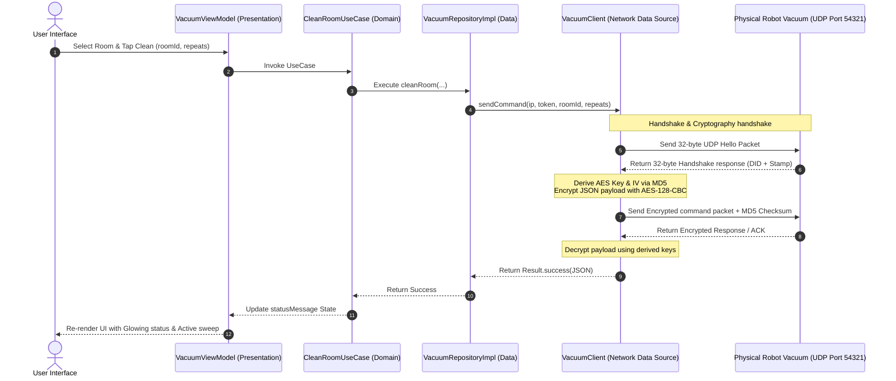

<div align="center">
  <h1>🧹 LoopSweep</h1>
  <p><strong>A Next-Generation, Beautifully Crafted Robot Vacuum Controller built with Compose Multiplatform.</strong></p>

  <div style="margin: 20px 0;">
    <div style="display: inline-block; text-align: center; padding: 20px 40px;">
      <br/>
      
    </div>
    <div style="display: inline-block; text-align: center; padding: 20px 40px;">
      <br/>
      
    </div>
  </div>

  [](http://kotlinlang.org)
  [](https://www.jetbrains.com/lp/compose-mpp/)
  [](#)
  [](#)
  [](#)
  [](LICENSE)
</div>

<br/>

## 🚀 The Paradigm Shift: Kotlin Multiplatform & Compose Multiplatform

<div align="center">
  
</div>

**LoopSweep** is built on **Compose Multiplatform** and **Kotlin Multiplatform (KMP)**—the state-of-the-art framework combination that has redefined the cross-platform development landscape. By moving away from slow, web-based hybrid wrappers (like Cordova or early-stage hybrid engines), LoopSweep utilizes a compile-to-native system that shares domain logic and renders pixel-perfect UIs with native performance.

### Why Compose Multiplatform is a Game-Changer 🎨
* **100% Declarative UI with Skia/Impeller:** Unlike older frameworks that translate UI layouts into native platform widgets (leading to rendering bugs or inconsistent themes across iOS and Android), Compose Multiplatform renders UI directly onto a high-performance **Skia** (or iOS **Impeller**) canvas. This ensures that custom animations, glassmorphic blur effects, and complex canvas layouts look **exactly the same** on a 120Hz iPhone screen, a 2K Android tablet, and a 4K Desktop monitor.
* **Unified State Hoisting:** By implementing Unidirectional Data Flow (UDF) through Kotlin Coroutines and StateFlows, UI state transitions remain extremely deterministic. You write the UI logic once in common Kotlin, and it handles states flawlessly on iOS, Android, and Desktop.
* **Uncompromised Native Interoperability:** Need native platform integration? Jetpack Compose does not isolate you in a sandbox. You can seamlessly embed iOS `UIKit` views (e.g. `UIViewControllerRepresentable`) or Android `XML/Compose` views within the shared layouts, giving you the best of both worlds.

### 📚 Official Resources & Learning Materials
To deep-dive into the technologies powering LoopSweep, check out the following curated resources:

* **Official Documentation:**
  * 📖 [Kotlin Multiplatform Portal](https://kotlinlang.org/docs/multiplatform.html) - Learn how code sharing works across platforms.
  * 🎨 [Compose Multiplatform Guide](https://www.jetbrains.com/lp/compose-mpp/) - JetBrains' official UI framework documentation.
  * 🎛️ [Jetpack Compose UI](https://developer.android.com/develop/ui/compose) - Google's modern declarative toolkit for Android.
* **Key Articles & Developments:**
  * 📰 [Kotlin Multiplatform is Stable](https://blog.jetbrains.com/kotlin/2023/11/kotlin-multiplatform-is-stable-and-production-ready/) - JetBrains' announcement of KMP stability for production use.
  * 🚀 [Compose Multiplatform for iOS is Beta](https://blog.jetbrains.com/kotlin/2023/05/compose-multiplatform-for-ios-is-in-alpha/) - Detail on the compiler optimizations and native iOS bindings.
  * ⚡ [Skia/Impeller Rendering Engine](https://blog.jetbrains.com/kotlin/2023/08/compose-multiplatform-1-5-0-release/) - The technology behind multi-platform pixel rendering.

---

## 🌟 Introduction & System Capabilities

**LoopSweep** is an enterprise-grade, cross-platform controller application designed to seamlessly monitor, schedule, and interact with smart robot vacuums over local network sockets and cloud endpoints. Engineered entirely with **Kotlin Multiplatform (KMP)** and **Compose Multiplatform**, the codebase compiles down to high-performance native binaries on Android, iOS (using Swift/Kotlin native bindings), and Desktop (JVM) platforms from a single shared module.

Rather than relying on basic static layouts, LoopSweep features real-time, hardware-driven **declarative Canvas animations**, mathematical obstacle-decay mapping, and telemetry tracking.

Key capabilities of the system include:
* **High-Performance UDP Networking:** Implements a direct local connection via Ktor sockets for real-time control with minimal latency.
* **Complete Cryptographic Engine:** Cryptographically secure payload processing with AES-128-CBC encryption and custom MD5 checksum injection.
* **Mi Cloud Integration:** Authenticates securely with Xiaomi regional servers and decrypts device details (tokens, IPs, DIDs) over HTTPS.
* **Real-time SLAM Map & Radar Scope:** Rendered using vector mathematics and custom canvas drawing to display obstacles, active trajectories, and sweep decay.

---

## 🎲 Interactive 3D Model Explorer

To understand the mechanical blueprint of the LoopSweep Robot Vacuum, a native 3D STL mesh has been generated.
👉 **[Click here to view, rotate, pan, and zoom the 3D Robot Vacuum Model directly in your browser on GitHub!](robot_3d_model.stl)**

### 3D Mesh Specification
The STL mesh model (`robot_3d_model.stl`) is generated algorithmically via a Python script (`generate_stl.py`). It consists of two stacked cylinders:
1. **Base Chassis:** A large cylinder with a radius of $150\text{ units}$ and a height of $50\text{ units}$ (representing the main body of the vacuum containing battery, brushes, and motor).
2. **LiDAR Turret:** A smaller concentric cylinder on top with a radius of $30\text{ units}$ and a height of $20\text{ units}$ (housing the rotating LDS distance sensor).

The vertices and facet normals are calculated geometrically using:
$$x = r \cos(\theta), \quad y = r \sin(\theta)$$
where $\theta$ is partitioned into 64 segments for the base and 32 segments for the turret to produce a smooth circular surface.

---

## ⚙️ Core Architectural Design (Clean Architecture & UDF)

LoopSweep adheres strictly to **Clean Architecture** patterns combined with **Unidirectional Data Flow (UDF)**. This guarantees that platform-specific implementations (Android, iOS, Desktop) remain simple UI shells, while all domain logic, networking, and state management are encapsulated in the shared module.

### Architecture Data & Control Flow

The sequence diagram below describes how a user action on the UI triggers a low-level UDP network packet, updates the remote physical hardware, and flows telemetry back to state-hoisted composables:



### Detailed Package & Class Structure

The codebase is organized in a highly modular fashion:

```text
LoopSweep/
├── shared/                                 # Shared module containing 100% of core logic & UI
│   └── src/
│       ├── commonMain/
│       │   ├── composeResources/           # Platform-independent resources (drawables, XMLs, fonts)
│       │   └── kotlin/com/vahitkeskin/loopsweep/
│       │       ├── data/                   # Data Access Layer
│       │       │   ├── local/              # Local storage implementations
│       │       │   │   └── DataStore.kt    # Preferences DataStore for managing connection configurations
│       │       │   ├── network/            # Low-Level Network APIs
│       │       │   │   ├── VacuumClient.kt # Ktor UDP Socket Client handling handshake and crypto
│       │       │   │   └── XiaomiCloudClient.kt # HTTPS client for regional authentication & token extraction
│       │       │   └── repository/         # Implementation of domain boundary interfaces
│       │       │       ├── VacuumRepositoryImpl.kt # Bridges local UDP network operations
│       │       │       └── XiaomiCloudRepositoryImpl.kt # Bridges Xiaomi Cloud operations
│       │       ├── di/                     # Dependency Injection Layer
│       │       │   └── AppContainer.kt     # Manual Dependency Injection container
│       │       ├── domain/                 # Domain/Business Logic Layer (Pure Kotlin, Framework-free)
│       │       │   ├── model/              # Domain Models
│       │       │   │   ├── RoomItem.kt     # Mapped Room configurations
│       │       │   │   ├── VacuumProperties.kt # Status and Battery levels
│       │       │   │   ├── VacuumTelemetry.kt # Comprehensive hardware metrics & raw JSON
│       │       │   │   └── XiaomiDevice.kt # Discovered cloud device entities
│       │       │   ├── repository/         # Repository interfaces (abstraction boundaries)
│       │       │   └── usecase/            # Use Cases (Business Logic orchestrators)
│       │       │       ├── CleanRoomUseCase.kt
│       │       │       ├── StopVacuumUseCase.kt
│       │       │       ├── DockVacuumUseCase.kt
│       │       │       ├── GetRoomsUseCase.kt
│       │       │       ├── GetVacuumPropertiesUseCase.kt
│       │       │       ├── GetVacuumTelemetryUseCase.kt
│       │       │       └── LoginXiaomiCloudUseCase.kt
│       │       ├── presentation/           # Presentation Layer (State management via MVVM)
│       │       │   ├── VacuumViewModel.kt  # Polling, status mapper, history tracking, event logger
│       │       │   └── XiaomiCloudViewModel.kt # Handles cloud authentication and device queries
│       │       ├── ui/                     # UI Layout Layer (Compose Multiplatform)
│       │       │   ├── screen/             # Top-Level Layout Screens
│       │       │   │   ├── VacuumScreen.kt # Main dashboard interface layout
│       │       │   │   └── XiaomiCloudScreen.kt # Cloud login, device sync, and token manager
│       │       │   ├── components/         # Reusable Canvas-based Components
│       │       │   │   ├── HeaderCard.kt   # IP and Token details with interactive text fields
│       │       │   │   ├── RealisticRadarCard.kt # Tactical sweep visualization card
│       │       │   │   ├── RobotVacuumButtonContent.kt # Central button with rotating brushes and flashing LEDs
│       │       │   │   ├── RoomCard.kt     # Grid cards representing rooms
│       │       │   │   ├── StatusBarCard.kt # Suction and water levels selector
│       │       │   │   └── TelemetryDashboard.kt # Grid details, trajectory paths, progress indicators
│       │       │   └── theme/              # Color palettes, typography configurations, shapes
│       │       └── VacuumApp.kt            # Core entry point setting up scaffold, navigation & glassmorphic nav bar
```

---

## 🔌 Low-Level Local UDP Socket & Miio Protocol

The application communicates directly with the robot vacuum's onboard controller using **Ktor Sockets** over local UDP broadcast ports. It implements the custom, encrypted **Miio protocol** combined with standard **MIoT (Xiaomi IoT) schema properties**.

### 1. Packet Binary Layout Specification

All local network requests and responses conform to the following binary structure:

| Byte Offset | Field Name | Data Type | Description |
| :---: | :--- | :---: | :--- |
| **`0x00 - 0x01`** | **Magic Header** | `UInt16` | Fixed to `0x2131`. Used by the device to identify Miio packets. |
| **`0x02 - 0x03`** | **Packet Length** | `UInt16` | Total length of the packet in bytes (Header + Payload) in Big-Endian. |
| **`0x04 - 0x07`** | **Unknown / Padding** | `UInt32` | Reserved. Always initialized to `0x00000000`. |
| **`0x08 - 0x0B`** | **Device ID (DID)** | `UInt32` | Unique device identifier. Discovered during the UDP handshake. |
| **`0x0C - 0x0F`** | **Stamp** | `UInt32` | Unix epoch timestamp of the packet transaction (seconds since epoch). |
| **`0x10 - 0x1F`** | **MD5 Checksum** | `16 Bytes` | Computed MD5 signature. Used for packet integrity and token authentication. |
| **`0x20 - End`** | **Encrypted Payload** | `ByteArray` | Ciphertext containing JSON payload encrypted with AES-128-CBC. |

#### A. Hello Handshake Packet Structure (32 Bytes)
During the initialization phase, the client broadcasts a 32-byte Hello packet to discover the Device ID and Stamp. The checksum field is populated with the device token (or `0xFF` padding if unknown):

```hexdump
Offset: 00 01 02 03 04 05 06 07 08 09 0A 0B 0C 0D 0E 0F
------------------------------------------------------
0x0000: 21 31 00 20 00 00 00 00 FF FF FF FF FF FF FF FF
0x0010: FF FF FF FF FF FF FF FF FF FF FF FF FF FF FF FF
```

#### B. Handshake Response Packet Structure (32 Bytes)
The device responds with its unique DID and the current epoch timestamp:

```hexdump
Offset: 00 01 02 03 04 05 06 07 08 09 0A 0B 0C 0D 0E 0F
------------------------------------------------------
0x0000: 21 31 00 20 00 00 00 00 06 A9 BC 11 60 A8 3F E5
0x0010: FF FF FF FF FF FF FF FF FF FF FF FF FF FF FF FF  <-- (Contains Device ID & Sync Stamp)
```

### 2. Ktor UDP Socket Connection Lifecycle

UDP operations are handled asynchronously using Ktor Sockets. The client establishes a selector manager, binds to a dynamic local socket, transmits the payload datagram, and waits for a response with a configurable timeout:

```kotlin
private suspend fun sendUdp(host: String, port: Int, requestBytes: ByteArray, timeoutMs: Long = 2000): ByteArray? {
    return withContext(Dispatchers.Default) {
        val selectorManager = SelectorManager(Dispatchers.Default)
        val socket = aSocket(selectorManager).udp().bind()
        try {
            withTimeout(timeoutMs) {
                val address = InetSocketAddress(host, port)
                val datagram = Datagram(ByteReadPacket(requestBytes), address)
                socket.send(datagram)
                val response = socket.receive()
                response.packet.readBytes()
            }
        } catch (e: Exception) {
            Logger.e("VacuumClient", "UDP Error (host=$host, port=$port): ${e.message}", e)
            null
        } finally {
            socket.close()
            selectorManager.close()
        }
    }
}
```

---

## 🔒 Cryptographic Key Derivation & Encryption Engine

To prevent unauthorized commands, the communication payload is encrypted using the symmetric **AES-128-CBC** standard.

### 1. Key & IV Derivation Formula

The 32-character Hex Token configured for the vacuum is converted to a 16-byte raw byte array. The encryption Key and Initialization Vector (IV) are derived using MD5 hashes:

$$\text{Key} = \text{MD5}(\text{TokenBytes})$$
$$\text{IV} = \text{MD5}(\text{Key} + \text{TokenBytes})$$

* The `TokenBytes` represent the 16-byte raw representation of the Hex Token.
* The derived `Key` is the 16-byte MD5 hash of the token.
* The `IV` is the 16-byte MD5 hash of the concatenation of the derived `Key` and the raw `TokenBytes`.

### 2. Encryption Process

1. **JSON Payload Generation:** Write the command parameters as a JSON string (e.g. `{"id":1,"method":"action","params":{...}}`).
2. **Padding:** The JSON byte array is padded to a multiple of 16 bytes using standard **PKCS7** padding rules.
3. **AES Cipher execution:** Encrypt the padded bytes using AES-128-CBC with the derived Key and IV.
4. **MD5 Checksum Injection:** 
   Assemble the full packet with the MD5 Checksum field filled with the raw `TokenBytes`. Once assembled, compute the MD5 hash over the entire packet:
   $$\text{Checksum} = \text{MD5}(\text{PacketBytes})$$
   Overwrite the MD5 Checksum field (bytes `0x10 - 0x1F`) with this computed signature.
5. **UDP Transmission:** Broadcast the packet to local port `54321`.

```kotlin
private fun buildCommandPacket(deviceId: ByteArray, stamp: Int, tokenBytes: ByteArray, payload: ByteArray): ByteArray {
    val length = 32 + payload.size
    val packet = ByteArray(length)
    packet[0] = 0x21.toByte()
    packet[1] = 0x31.toByte()
    packet[2] = ((length ushr 8) and 0xFF).toByte()
    packet[3] = (length and 0xFF).toByte()
    packet[4] = 0x00.toByte()
    packet[5] = 0x00.toByte()
    packet[6] = 0x00.toByte()
    packet[7] = 0x00.toByte()
    deviceId.copyInto(packet, 8, 0, 4)
    packet[12] = ((stamp ushr 24) and 0xFF).toByte()
    packet[13] = ((stamp ushr 16) and 0xFF).toByte()
    packet[14] = ((stamp ushr 8) and 0xFF).toByte()
    packet[15] = (stamp and 0xFF).toByte()
    tokenBytes.copyInto(packet, 16, 0, 16)
    payload.copyInto(packet, 32, 0, payload.size)
    val checksum = MD5.hash(packet)
    checksum.copyInto(packet, 16, 0, 16)
    return packet
}
```

---

## 🔌 MIoT Property Schema & Command Mapping

The application maps user actions to specific MIoT services (`siid`), properties (`piid`), and actions (`aiid`):

### Actions Mapping Table

| Action Description | Service ID (`siid`) | Action ID (`aiid`) | Arguments Array (`in`) | Mapped JSON Method |
| :--- | :---: | :---: | :---: | :--- |
| **Clean All (Tüm Ev)** | `2` | `6` | `[]` | `{"method":"action","params":{"siid":2,"aiid":6,"in":[]}}` |
| **Clean Specific Room** | `7` | `3` | `["roomId", 0, 1]` | `{"method":"action","params":{"siid":7,"aiid":3,"in":["<roomId>",0,1]}}` |
| **Clean Specific Map Area** | `12` | `1` | `[areaId]` | `{"method":"action","params":{"siid":12,"aiid":1,"in":[<areaId>]}}` |
| **Stop / Pause Cleaning** | `2` | `2` | `[]` | `{"method":"action","params":{"siid":2,"aiid":2,"in":[]}}` |
| **Return to Charging Dock** | `2` | `3` | `[]` | `{"method":"action","params":{"siid":2,"aiid":3,"in":[]}}` |
| **Retrieve Map Configurations**| N/A | N/A | `[]` | `{"method":"get_map","params":[]}` |

### Telemetry Properties Query Schema

When polling the device status, the client queries multiple property IDs simultaneously using the `get_properties` method. The following table describes the mapped variables:

| Mapped Property | SIID | PIID | Data Type | Value Schema / Enumeration | UI Representation |
| :--- | :---: | :---: | :---: | :--- | :--- |
| **Device Status** | `2` | `1` | `Int` | 1=Idle, 2=Pause, 3=Charging, 4=Charged, 5=Cleaning, 6=Return to Dock, 7=Smart Clean | Custom animations and text label mapping |
| **Device Fault Code** | `2` | `2` | `Int` | 0=No Fault, 1=Wheel Stuck, 2=LiDAR Jammed, 3=Cliff Sensor, etc. | Event Logger red warning text |
| **Battery Level** | `3` | `1` | `Int` | `0` to `100` (%) | Battery percentage icon, charging status & history chart |
| **Suction Power Level** | `7` | `5` | `Int` | 1=Silent, 2=Standard, 3=Strong, 4=Turbo | Suction status card & Segmented power bars |
| **Water Pump Flow Rate**| `7` | `6` | `Int` | 1=Low, 2=Medium, 3=High | Water rate card & Segmented flow bars |
| **Clean Time** | `7` | `22`| `Int` | Time elapsed in minutes | Telemetry grid info |
| **Clean Area** | `7` | `23`| `Int` | Mapped area in square meters | Telemetry grid info & historical grid charts |
| **Side Brush Health** | `7` | `8` | `Int` | `0` to `100` (%) | Consumable health ring gauge |
| **Main Brush Health** | `7` | `10`| `Int` | `0` to `100` (%) | Consumable health ring gauge |
| **Filter Health** | `7` | `12`| `Int` | `0` to `100` (%) | Consumable health ring gauge |
| **Mop Health** | `7` | `14`| `Int` | `0` to `100` (%) | Consumable health ring gauge |
| **SLAM Path Stream** | `10`| `5` | `String` | Base64/Hex coordinate stream payload | Trajectory path canvas plotting |

---

## 🎨 Advanced UI Components & Mathematical Graphics

The application's aesthetics combine frosted-glass elements (**Glassmorphism**) and responsive canvas plotting:

### 1. Centrifugal Side Brush Flexing Math (`RobotVacuumButtonContent`)

The central button animates according to the current cleaning state. The side brush rotates while simulating centrifugal friction:
* **LiDAR Rotation:** The LiDAR turret rotates infinitely using a $360^\circ$ linear transition.
* **Side Brush Deformation (Flexing):** To simulate drag forces pushing against floor surfaces, the side brush scales dynamically based on a sinusoidal bounce:
  $$\text{Scale} = 1.0 + (\text{ArmFlex} + 0.4) \times 0.1$$
  where $\text{ArmFlex}$ oscillates between $-0.2$ and $-0.6$ using a `FastOutSlowInEasing` curve.

### 2. LDS Radar Obstacle Fade Decay (`RealisticRadarDisplay`)

The radar view simulates real-time LiDAR beam sweeping. Obstacles (blips) light up as the line passes over them and gradually fade, maintaining trailing persistence:

```text
               Radar Sweep Center
                       o
                      / \
                     /   \
                    /     \   <-- RadialAzimuth Axes (45°, 90°, etc)
                   /   *   \  Target Blip (MASA-AYAK)
                  /         \
                 /===========\ <-- Concentric Range Rings (25%, 50%, 75%, 100%)
```

* **Azimuth Normalization:** The target coordinates relative to the center are computed:
  $$\theta_{\text{target}} = \text{atan2}(dy, dx) \times \frac{180}{\pi}$$
  and normalized to $[0^\circ, 360^\circ)$.
* **Decay Rate Formula:** Opacity (opacity value $\alpha$) decreases exponentially as the sweep line moves past:
  $$\alpha = e^{-\Delta\theta \times 0.018}$$
  where $\Delta\theta = (\theta_{\text{sweep}} - \theta_{\text{target}} + 360) \pmod{360}$. This leaves a smooth gradient trail behind the sweep line.
* **Reticle Lock:** A cyan reticle locking system matches coordinates and highlights the nearest primary target, drawing concentric circles and crosshairs:
  ```kotlin
  if (target.desc == "MASA-AYAK" && blipAlpha > 0.4f) {
      val lockRatio = (1.0f - blipAlpha) * 15f
      drawCircle(
          color = Color(0xFF06B6D4).copy(alpha = blipAlpha * 0.7f),
          center = targetPos,
          radius = target.size * 1.5f + lockRatio,
          style = Stroke(width = 1f)
      )
  }
  ```

### 3. Custom Canvas Icons & Coordinates

The premium bottom navigation bar utilizes mathematical geometry instead of vector drawable files to ensure rendering performance and pixel sharpness:

* **`BarcodeIcon`**: Renders dynamic barcodes via structured `drawLine` vertical paths:
  ```kotlin
  drawLine(color, Offset(w * 0.15f, h * 0.2f), Offset(w * 0.15f, h * 0.8f), strokeWidth * 1.5f)
  drawLine(color, Offset(w * 0.30f, h * 0.2f), Offset(w * 0.30f, h * 0.8f), strokeWidth * 0.5f)
  drawLine(color, Offset(w * 0.42f, h * 0.2f), Offset(w * 0.42f, h * 0.8f), strokeWidth * 1.2f)
  ```
* **`StatisticsIcon`**: Draws three vertical dynamic rounded-rect charts:
  ```kotlin
  drawRoundRect(color, topLeft = Offset(spacing, h * 0.5f), size = Size(barWidth, h * 0.5f), ...)
  drawRoundRect(color, topLeft = Offset(spacing * 2 + barWidth, h * 0.2f), size = Size(barWidth, h * 0.8f), ...)
  ```
* **`PurchaseIcon`**: Combines quadratic Bezier curves for the handle and filled polygons for the basket body:
  ```kotlin
  val pathHandle = Path().apply {
      moveTo(w * 0.25f, h * 0.5f)
      quadraticTo(w * 0.5f, h * 0.1f, w * 0.75f, h * 0.5f)
  }
  ```

---

## ☁️ Xiaomi Cloud Integration & Signature Cryptography

To simplify device setup, LoopSweep includes a **Mi Cloud Integration client** which authenticates with Xiaomi regional servers and decrypts local IP addresses and tokens.

### 1. Authentication Handshake
- **Login Request:** Posts to `https://account.xiaomi.com/pass/serviceLoginAuth2?sid=xiaomiio&_json=true` using the username and a hashed password representation.
- **Service Redirection:** Extracts `location`, `ssecurity`, and `userId`. A secondary GET request to `location` retrieves the HTTP `serviceToken` cookie.

### 2. Request Signing Algorithm
To securely communicate with the API endpoints (e.g. `api.io.mi.com/app/home/device_list`), every payload must be signed using a dynamic SHA-256 Nonce structure:

1. **Nonce Generation:** Consists of 8 random bytes combined with 4 bytes representing the current time in minutes since epoch:
   $$\text{NonceBytes} = \text{RandomBytes}_{[0..7]} + \text{EpochMinutesBytes}_{[8..11]}$$
   $$\text{NonceBase64} = \text{Base64Encode}(\text{NonceBytes})$$
2. **Signature Generation:**
   $$\text{SignedNonce} = \text{SHA256}(\text{Base64Decode}(\text{ssecurity}) + \text{Base64Decode}(\text{NonceBase64}))$$
   $$\text{Message} = \text{Path} + \text{"&"} + \text{Base64Encode}(\text{SignedNonce}) + \text{"&"} + \text{NonceBase64} + \text{"&data="} + \text{PostData}$$
   $$\text{Signature} = \text{HMAC-SHA256}(\text{SignedNonce}, \text{Message})$$

---

## 🛠️ Build-Time Source Generation (`BuildConfig`)

To avoid committing sensitive credentials, `shared/build.gradle.kts` automatically generates a type-safe `BuildConfig` file during compilation:

1. Gradle checks for a local configuration file named `local.properties` in the root directory.
2. It extracts `vacuum.ip` and `vacuum.token` properties.
3. It generates `BuildConfig.kt` inside the KMP shared package space, making variables accessible to the shared Kotlin code:

```kotlin
package com.vahitkeskin.loopsweep

object BuildConfig {
    const val VACUUM_IP: String = "192.168.1.150"
    const val VACUUM_TOKEN: String = "4a526f6b5f546f6b656e5f5f5f5f5f5f"
}
```

---

## 🚀 Getting Started & Build Instructions

### Prerequisites
* **Android Studio Koala (2024.1+)** or **IntelliJ IDEA Ultimate**
* **JDK 17 or JDK 21** configured in your system and IDE settings
* **Kotlin Multiplatform Plugin** enabled in the IDE
* **Xcode (15+)** (required only for compiling and running the iOS target on macOS)

### Local Configuration
Create a `local.properties` file in the root directory of the project and add your device details:
```properties
vacuum.ip=192.168.1.150
vacuum.token=4a526f6b5f546f6b656e5f5f5f5f5f5f
```

### Compiling and Launching Targets
Run commands from the root directory or use Android Studio configurations:

#### 🤖 Android App
```bash
# Assemble and install the debug binary on a connected device/emulator
./gradlew :androidApp:installDebug
```

#### 💻 Desktop JVM App
```bash
# Run the Desktop target (supports Hot Reload and JVM window configuration)
./gradlew :desktopApp:run
```

#### 🍎 iOS App (Swift & Compose Integration)
1. Open the `/iosApp` directory in Xcode.
2. Select your target simulator or physical device.
3. Press `Cmd + R` to compile the Kotlin framework and run the Swift wrapper.

---

## 🤝 Contributing & License

Contributions are welcome! Please follow these steps to contribute:
1. Fork this project.
2. Create a feature branch (`git checkout -b feature/AmazingFeature`).
3. Commit your changes (`git commit -m 'Add some AmazingFeature'`).
4. Push to the branch (`git push origin feature/AmazingFeature`).
5. Open a Pull Request.

This project is licensed under the MIT License. See the [LICENSE](LICENSE) file for details.

---

<div align="center">
  <i>Crafted with ❤️ for a cleaner home and cleaner code.</i>
</div>