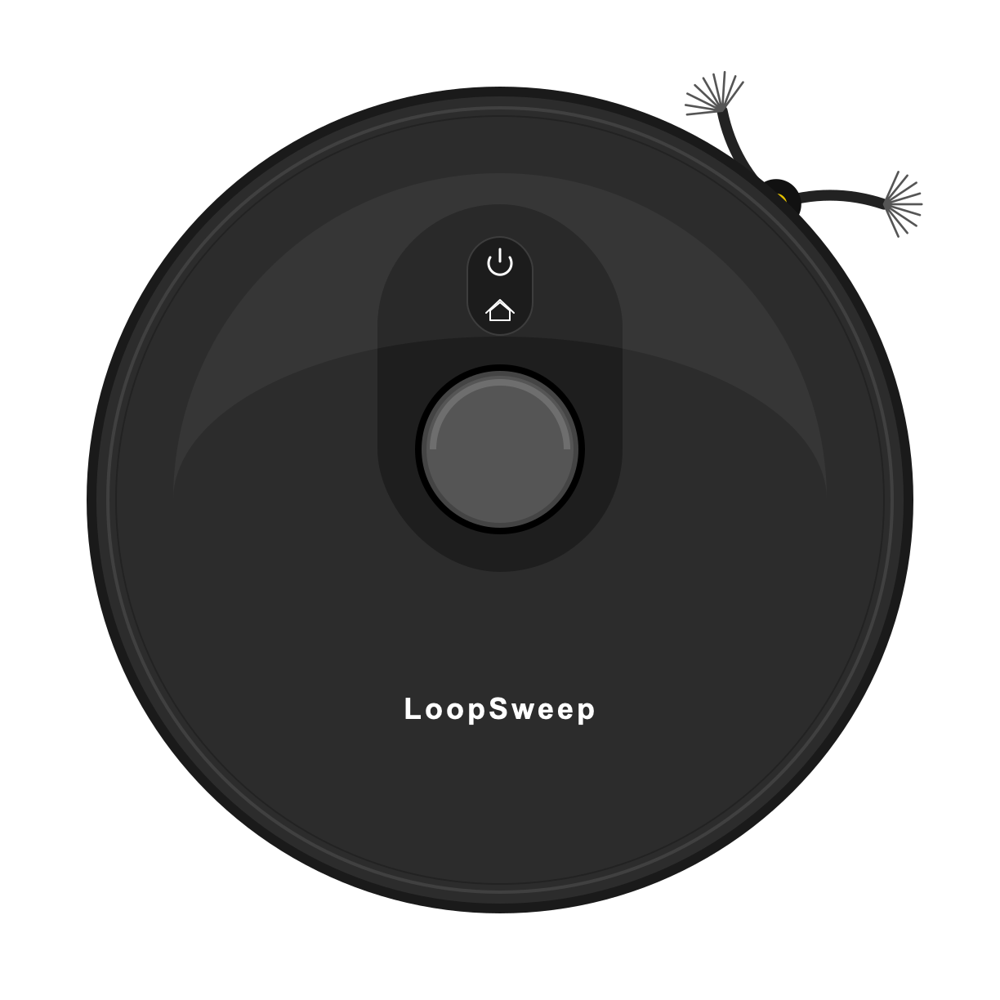

<div align="center">
  
  
  <br/>
  <a href="README.md"></a>
  &nbsp;&nbsp;&nbsp;
  <a href="README_PAUSED.md"></a>
  <br/>

  # 🧹 LoopSweep
  **A Next-Generation, Beautifully Crafted Robot Vacuum Controller built with Compose Multiplatform.**
  
  [](http://kotlinlang.org)
  [](https://www.jetbrains.com/lp/compose-mpp/)
  [](#)
  [](#)
  [](#)
</div>

<br/>

## 🌟 Overview

**LoopSweep** is a cutting-edge cross-platform application designed to control, monitor, and manage your smart robot vacuum cleaner. Built entirely with **Kotlin Multiplatform (KMP)** and **Compose Multiplatform**, it delivers a pixel-perfect, native-like experience across Android, iOS, and Desktop environments using a single shared codebase.

Instead of relying on static assets, LoopSweep uses high-performance, real-time **Canvas Drawing** and **Infinite Animations** to bring the robot vacuum to life right inside your UI!

---

## 🎲 3D Model Explorer (Interactive)
Want to explore the physical shape of the LoopSweep Robot Vacuum? We have prepared a 3D STL model for you.
👉 **[Click here to view and interact with the 3D Robot Vacuum Model (Rotate, Zoom, and Pan natively on GitHub!)](robot_3d_model.stl)**

---

## ✨ Key Features

### 🎨 Stunning Visuals & UI
* **Glassmorphism Design:** Beautiful frosted-glass translucent bottom navigation bars.
* **Dark Mode Native:** A deeply immersive, sleek dark theme with glowing neon accents (`#10B981` Green for active cleaning, `#FBBF24` Gold for charging).
* **Minimalist Aesthetics:** Custom-drawn icons, precisely tailored stroke widths (`0.4.dp`), and refined component sizing for a premium feel.

### 🤖 Dynamic Canvas Animations (`RobotVacuumButtonContent`)
The centerpiece of the application is the `RobotVacuumButtonContent`, entirely built from scratch using Compose `Canvas` and `ImageVector`s.
* **LiDAR Turret:** A miniaturized, chrome-bezeled LiDAR dome that spins realistically during cleaning.
* **Flexing Side Brushes:** Advanced infinite animations calculate real-time drag and bristle-spread as the side brushes spin!
* **Pulsing Status LEDs:** Glowing Power and Home indicators that breathe based on the robot's current state (Cleaning / Charging).

---

## 🏛️ Project Architecture

LoopSweep follows modern Android and KMP best practices, relying heavily on **Unidirectional Data Flow (UDF)** and a clean separation of concerns.

* **UI Layer:** Completely written in Compose Multiplatform. State is hoisted to parent components (`VacuumApp`) and passed down as immutable properties to stateless composables.
* **Component-Based Architecture:** Every distinct UI element is separated into its own module under `ui/components` (e.g., `RobotVacuumButtonContent`, `GlassmorphicBottomNavigation`, `XiaomiCloudScreen`).
* **Shared Logic:** The `shared/` module is the single source of truth for business logic, state management, and UI rendering. Platform-specific modules only act as thin entry points.

---

## 📦 Detailed Package Structure

The repository is organized following standard Kotlin Multiplatform guidelines:

```text
LoopSweep/
├── shared/                                 # The core logic & UI shared across ALL platforms!
│   └── src/
│       ├── commonMain/
│       │   ├── composeResources/           # Cross-platform fonts, SVGs, and images
│       │   └── kotlin/com/vahitkeskin/loopsweep/
│       │       ├── ui/
│       │       │   ├── components/         # Reusable UI widgets (RobotVacuumButtonContent, Buttons)
│       │       │   ├── screen/             # Full screen layouts (XiaomiCloudScreen, MapScreen)
│       │       │   └── theme/              # Color palettes, Typography, and Shapes
│       │       ├── utils/                  # Helper classes, Logger expectations, Preview annotations
│       │       └── VacuumApp.kt            # The root Compose application state holder
│       ├── androidMain/                    # Android-specific actual implementations (e.g., System Logger)
│       ├── iosMain/                        # iOS-specific actual implementations
│       └── desktopMain/                    # JVM/Desktop window settings & actual implementations
├── androidApp/                             # Android application entry point (MainActivity)
├── desktopApp/                             # Desktop (JVM) main function & packaging
└── iosApp/                                 # Xcode project and SwiftUI wrapper for iOS
```

---

## 💻 Tech Stack & Technologies

LoopSweep is built on the shoulders of giants. Here are the core technologies powering the app:

* **Kotlin (2.x):** Modern, expressive, and type-safe programming language.
* **Compose Multiplatform (1.6+):** JetBrains' declarative UI framework allowing UI sharing across iOS, Android, and Desktop.
* **Kotlin Coroutines:** For non-blocking, asynchronous state handling and background tasks.
* **Gradle Version Catalogs & Kotlin DSL:** For clean, type-safe, and centralized dependency management (`libs.versions.toml`).
* **Coil-Compose:** High-performance image loading and caching for cross-platform.
* **Cairosvg & Pillow (Python):** Custom developer scripts (`scripts/`) used to dynamically generate perfectly looped SVGs and GIFs for README and mockups.

---

## 🚀 Getting Started

### Prerequisites
* **Android Studio** (Koala or newer) or **IntelliJ IDEA Ultimate**
* **Kotlin Multiplatform Mobile (KMM) Plugin** installed in your IDE
* **Xcode** (if you want to run the iOS app on a Mac)

### Running the Apps
You can easily launch the applications using the IDE Run Configurations or via Gradle:

#### 🤖 Android App
```bash
./gradlew :androidApp:assembleDebug
# Or just hit "Run 'androidApp'" in Android Studio
```

#### 💻 Desktop App (Windows / macOS / Linux)
```bash
# Standard Run
./gradlew :desktopApp:run

# Development Run with Hot Reload enabled
./gradlew :desktopApp:hotRun --auto
```

#### 🍎 iOS App
1. Open the `iosApp` directory in Xcode.
2. Select your target simulator or device.
3. Hit **Build and Run** (`Cmd + R`).

---

## 🤝 Contributing
Contributions, issues, and feature requests are welcome!
Feel free to check the [issues page](#) if you want to contribute.

1. Fork the Project
2. Create your Feature Branch (`git checkout -b feature/AmazingFeature`)
3. Commit your Changes (`git commit -m 'Add some AmazingFeature'`)
4. Push to the Branch (`git push origin feature/AmazingFeature`)
5. Open a Pull Request

---

## 📄 License
This project is licensed under the MIT License - see the [LICENSE](LICENSE) file for details.

<br/>

<div align="center">
  <i>Crafted with ❤️ for a cleaner home and cleaner code.</i>
</div>